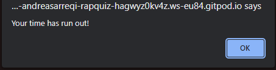
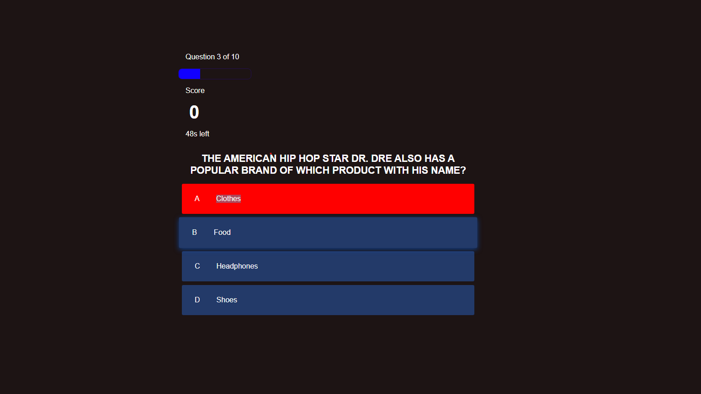
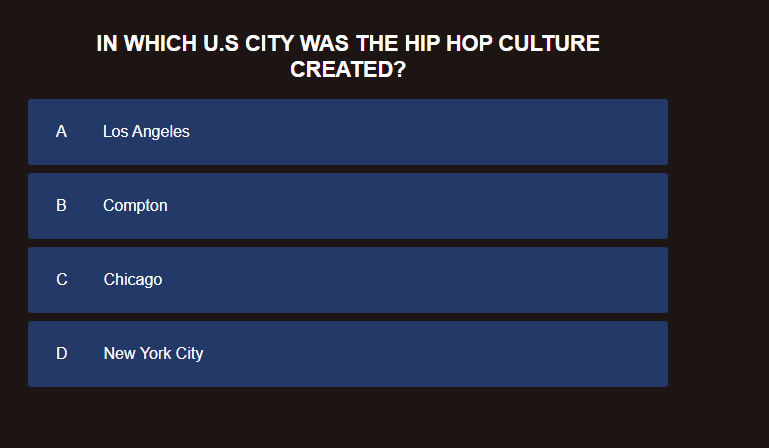
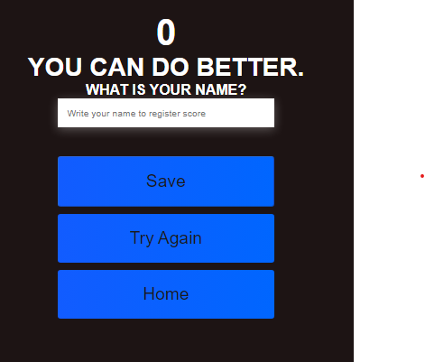

# Rap Quiz

## Introduction

Welcome to my very own rap quiz. As soon as you go into the live webiste there are 2 paragraphs.
Both of the paragraphs give you some quick info bout Rap/Hip-hop genre before going into the quiz page.

### Features

Alert

Alert after the time has run out.

Correct Answer

The correct answer turns green.

Incorrect Answer

The incorrect answer turns red.

Question List

The questions are randomized and have hover effect.

Play or High Score buttons

The buttons take you to the quiz or to thte high score page.

Timer

Register

Register Your name/Try again or Go to the home page

Score

Question Bar

Leaderboard

### Future Features
- Would've liked to add a background image and some colors to the web page. Since i had some unforseen issues with teh deployed page i removed the background image which was intended to be part of the page from the start.

## Testing 

### Validator Testing 

### Unfixed Bugs

## Deployment

## Credits 
 

### Media

